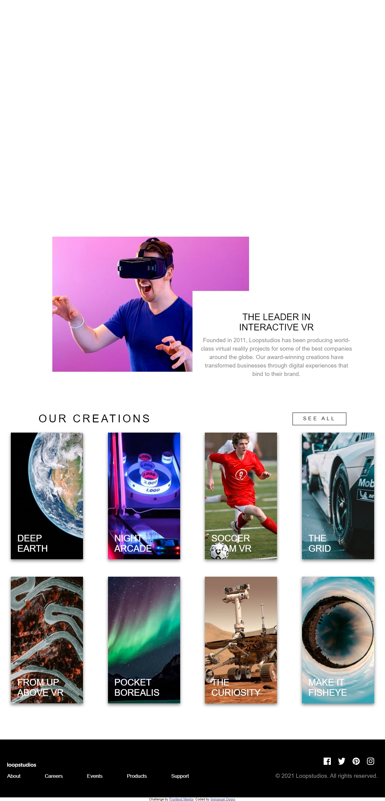

# Frontend Mentor - Loopstudios landing page solution

This is a solution to the
[Loopstudios landing page challenge on Frontend Mentor](https://www.frontendmentor.io/challenges/loopstudios-landing-page-N88J5Onjw).
Frontend Mentor challenges help you improve your coding skills by building realistic projects.

## Table of contents

- [Overview](#overview)
  - [The challenge](#the-challenge)
  - [Screenshot](#screenshot)
  - [Links](#links)
- [My process](#my-process)
  - [Built with](#built-with)
  - [What I learned](#what-i-learned)
  - [Continued development](#continued-development)
  - [Useful resources](#useful-resources)
- [Author](#author)
- [Acknowledgments](#acknowledgments)

**Note: Delete this note and update the table of contents based on what sections you keep.**

## Overview

### The challenge

Users should be able to:

- View the optimal layout for the site depending on their device's screen size
- See hover states for all interactive elements on the page

### Screenshot

### Links

- Solution URL: [Add solution URL here](https://your-solution-url.com)
- Live Site URL: [Add live site URL here](https://your-live-site-url.com)

## My process

### Built with

- Semantic HTML5 markup
- CSS custom properties
- Flexbox
- CSS Grid
- Mobile-first workflow
- sass

### What I learned

Okay in this challenge i learnt how to use some properties like filter transform and transiitons i also sharpened my
grid and flexbox challenges. I finished this challenge within 2 day ("I didn't use the whole 48hrs lets say max 6 hours
). Year at a point my head was banging maybe due to the section that had an image overlaying another image i knew i
could do it cause infact i had done something similar in the past took a code i worked on reviewed it went to sleep so
my head could cool down a little came back and implemented it .So the reason that section gave me a lot of trouble was
because i was using positioning and say start okay before approaching the middle it's trash again so after some thinking
and all i figured i'd use css grid. Now i expected the mobile navigation menu to give me alot of trouble but to my
greatest surprise it didn't more like a piece of cake

### Continued development

### Useful resources

## Author

- Frontend Mentor - [@yourusername](https://www.frontendmentor.io/profile/yourusername)

## Acknowledgments
